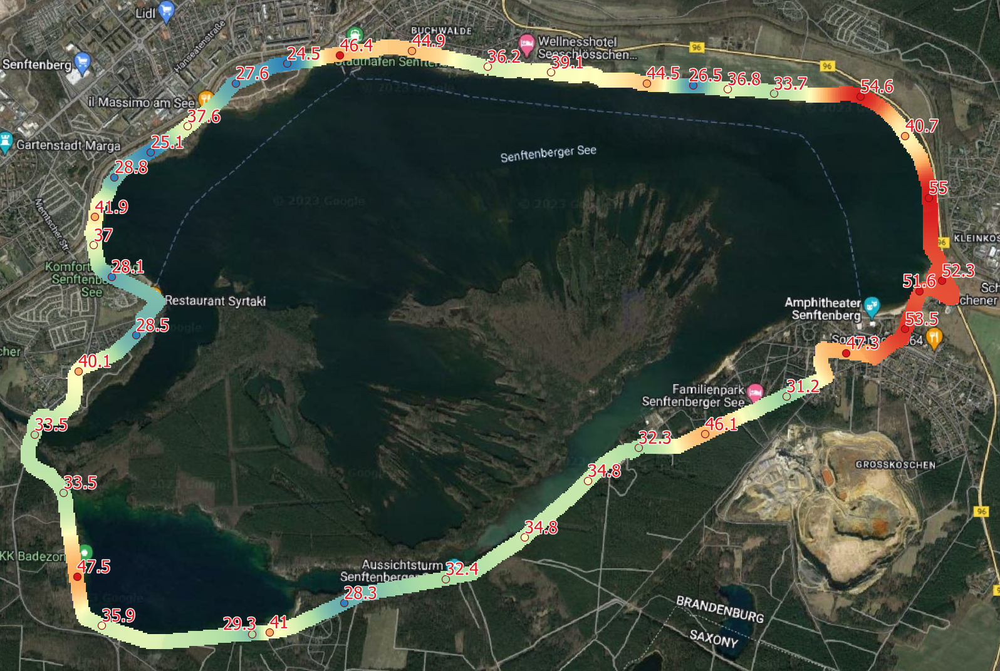
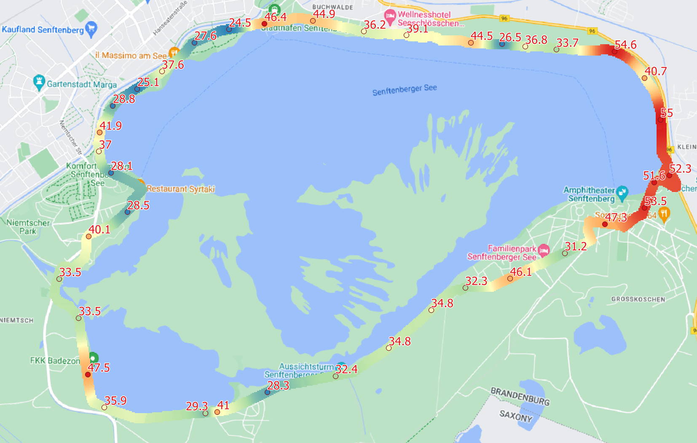
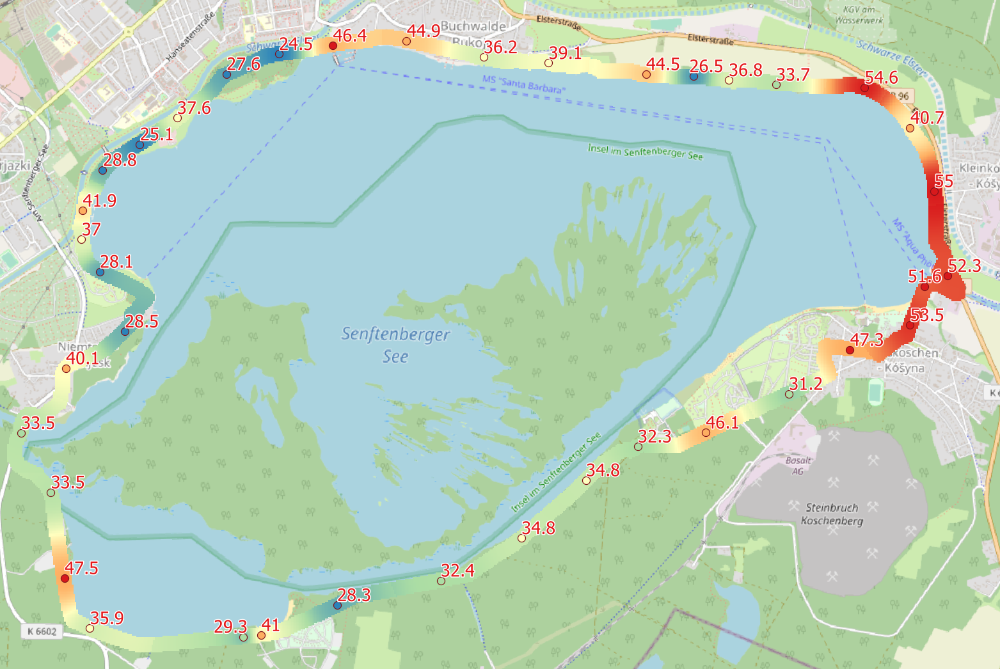
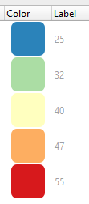

# Bicycle-Route-Temperature-Interpolation

This project aims to interpolate ground temperatures along bicycle routes, providing a continuous representation of the temperature. We use the Inverse Distance Weighting (IDW) method for interpolation.

Google MyMap Interactive Map: https://www.google.com/maps/d/u/0/edit?mid=1lascnAfJN3QGiN8bm1TWScEYSoeMrLU&usp=sharing
Google Colab: https://colab.research.google.com/drive/1udHDVL32y5od8932t3QlGPHJIEbG95MP?usp=sharing


## Setup
Ensure you have the required libraries installed:
```
pip install geopandas rasterio
```

## Code
```
# Importing necessary libraries
import geopandas as gpd
import numpy as np
import matplotlib.pyplot as plt
from scipy.spatial import KDTree
from shapely.geometry import Point
from rasterio.features import rasterize
from rasterio.transform import from_origin
import rasterio

# Load the shapefiles
bicycle_routes = gpd.read_file("Bicycle_Routes_50m.shp")
ground_temp_points = gpd.read_file("Points_GroundTEM.shp")

# Ensure both shapefiles have the same CRS
ground_temp_points = ground_temp_points.to_crs(bicycle_routes.crs)

# Visualize the data
fig, ax = plt.subplots(figsize=(12, 12))
bicycle_routes.plot(ax=ax, color="blue", label="Bicycle Routes")
ground_temp_points.plot(ax=ax, color="red", markersize=10, label="Ground Temp Points")
ax.set_title("Bicycle Routes and Ground Temperature Points")
plt.legend()
plt.show()

# Define the raster's resolution and bounds
resolution = 10  # 10 m resolution
bounds = bicycle_routes.total_bounds
x_min, y_min, x_max, y_max = bounds

# Define the IDW Interpolation function
def idw_interpolation_at_point(point, points, values, power=2, k=3):
    tree = KDTree(points)
    distances, indices = tree.query([point], k=k)
    weights = 1.0 / (distances[0] ** power)
    return np.sum(weights * values[indices[0]]) / np.sum(weights)

# Define the function to generate sample points within a geometry
def generate_sample_points_within_geometry(geometry, resolution):
    bounds = geometry.bounds
    x_min, y_min, x_max, y_max = bounds
    x_coords = np.arange(x_min, x_max, resolution)
    y_coords = np.arange(y_min, y_max, resolution)
    sample_points = []
    for x in x_coords:
        for y in y_coords:
            point = Point(x, y)
            if point.within(geometry):
                sample_points.append((x, y))
    return sample_points

# Extract ground temperature points and values
points = ground_temp_points.geometry.apply(lambda geom: (geom.x, geom.y)).to_list()
values = ground_temp_points["Ground_TEM"].to_numpy()

# Aggregate all bicycle route geometries into a single unified geometry
unified_route = bicycle_routes.geometry.unary_union

# Perform IDW interpolation over the unified bicycle route
sample_points_route = generate_sample_points_within_geometry(unified_route, resolution)
sample_values_route = [idw_interpolation_at_point(pt, points, values) for pt in sample_points_route]

# Convert sample points and their interpolated values to a GeoDataFrame
gdf_sample_points_route = gpd.GeoDataFrame({
    'geometry': [Point(pt) for pt in sample_points_route],
    'temperature': sample_values_route
}, crs=bicycle_routes.crs)

# Plot the interpolated values
fig, ax = plt.subplots(figsize=(12, 12))
bicycle_routes.plot(ax=ax, color="blue", label="Bicycle Routes")
gdf_sample_points_route.plot(ax=ax, column='temperature', cmap='viridis', markersize=10, legend=True)
ax.set_title("IDW Interpolated Ground Temperature over Bicycle Routes")
plt.show()

# Create a raster from the interpolated sample points
raster_shape = (int((y_max - y_min) / resolution), int((x_max - x_min) / resolution))
transform = from_origin(x_min, y_max, resolution, resolution)
raster_data = np.full(raster_shape, np.nan, dtype=np.float32)

# Fill the raster cells
for point, value in zip(sample_points_route, sample_values_route):
    row, col = (y_max - point[1]) // resolution, (point[0] - x_min) // resolution
    if 0 <= row < raster_shape[0] and 0 <= col < raster_shape[1]:
        raster_data[int(row), int(col)] = value

# Mask the raster based on the bicycle route
route_mask = rasterize(
    [(geom, 1) for geom in bicycle_routes.geometry],
    out_shape=raster_data.shape,
    transform=transform,
    fill=0,
    all_touched=True,
    dtype=np.uint8
)
raster_data[route_mask == 0] = np.nan

# Save the raster to a GeoTIFF file
output_raster_path = "IDW_Interpolated_Raster_within_Route.tif"
with rasterio.open(
    output_raster_path, 
    'w', 
    driver='GTiff',
    height=raster_data.shape[0],
    width=raster_data.shape[1],
    count=1,
    dtype=raster_data.dtype,
    crs=bicycle_routes.crs,
    transform=transform,
    nodata=np.nan
) as dst:
    dst.write(raster_data, 1)

print("Raster saved to:", output_raster_path)
```







